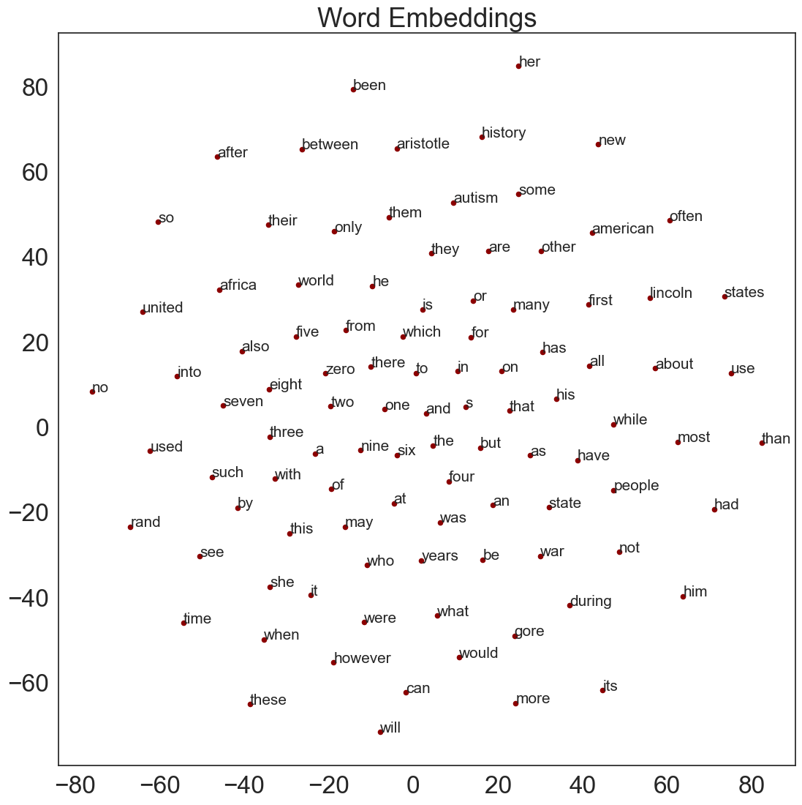
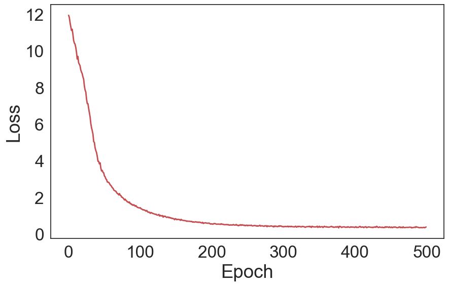

# Natural Language Processing algorithms
This repository contains a collection of Natural Language Processing algorithms, starting from the basic preprocessing and embedding algorithms to actual NLP models.

Before you start, please make sure you have the required packages installed, it is suffficient to run in your environment:

```bash
sh install.sh
```
in order to install all the required packages, whose complete list is in the requirements.txt file.

The repository is divided into different folders, each of which contains the algorithms, examples and basic datasets to test the model proposed.

## Overview
### Tokenization
The tokenization is the first step of the preprocessing, it is the process of breaking the text into a sequence of tokens. It is indeed a very important step in any NLP model, since it allows to clean up the corpus and make it easier for any other algorithm to learn from it.
In [tokenization](https://github.com/nicolezattarin/Natural-Language-Processing-algorithms/tree/main/tokenization) we exemplifies the use of several packages from the Natural Language Toolkit (NLTK) and provide function to have a fast access to those methods.

### Embedding
In order to deal wirth words in any NLP model, we need to embed them into a vector space. We provide an interface that implements s particular type of model called Word2Vec, which uses NN to find vector representations of words on the basis of their semantic meaning.
In particular, we rearranged the code available [here](https://github.com/udacity/deep-learning-v2-pytorch/tree/master/word2vec-embeddings) in a class that performs an automatic preprocessing of the corpus and provides an easy interface to create and train the model.

An example of possible results from training follows (trained with 500 epochs on the test corpus provided):
<p float="center">
  
  
</p>
 
